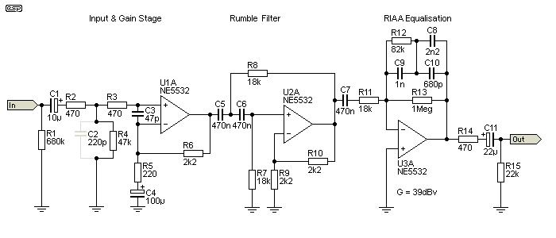

# KicadJE_RIAA
RIAA apllifier test

# Status - PCB tested - bad rca footprint
## Initial 
| Stage  | Detail | Status |
| ------------- | ------------- | ------------- |
| create material  | sch/pcb | OK  |
| | gerber | OK |
| production  |   | OK |
|  | produced | OK |
|  | delivered | OK |
## Preliminary validation
| Test  | Detail | Status |
| ------------- | ------------- | ------------- |
| Initial Inspection | | Chose different RCA |
| Initial Technical Test |  | Different RCA does not match pins |
| Initial Product Test |  |  |

## Secondary validation
| Test  | Detail | Status |
| ------------- | ------------- |------------- |
| Product Test |  | |
| Product Test |  |  |
| Quality | | |
| Quality | | |
| Long Term Product Test |  |  |
| Power Draw |  | 

## Errata
### Errata -
1 - RCA footprint wrong (flip gnd and right)

2 - V-GND 2 does not have resistor balance - only LED indicator as input

## Issues and Notes
### 

# Pictures

# Inspiration

http://audio.engineeringvista.com/AudioKits/Phono-1/Design/Part6.htm

http://sound.whsites.net/project25.htm
